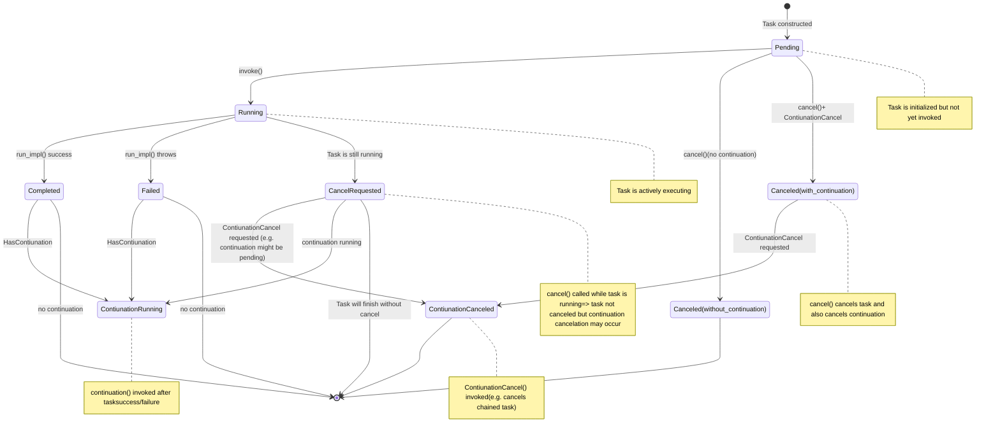

# task

A generic, header-only C++ task wrapper that supports cancellation, continuations, and result retrieval via futures.

## Features

- **Composable asynchronous tasks**: Chain tasks using `.then()`.
- **Cancellation support**: Cancel tasks before execution.
- **Continuation support**: Attach continuations to tasks for flexible workflows.
- **Future-based result access**: Retrieve results using `std::shared_future`.
- **Explicit invocation**: Control when tasks start via an invoker object.
- **Header-only**: Just include the headers, no linking required.

## State Diagram


## Getting Started

### Installation

This library is header-only. You can use one of the following methods:

#### 1. Manual Copy

Copy the contents of the `include/` directory into your project.

#### 2. CMake (find_package)

```cmake
find_package(task CONFIG REQUIRED)
target_link_libraries(your_target PRIVATE mgutility::task)
```

#### 3. CMake FetchContent

```cmake
include(FetchContent)
FetchContent_Declare(
    task
    GIT_REPOSITORY https://github.com/mguludag/task.git
    GIT_TAG        main
)
FetchContent_MakeAvailable(task)
target_link_libraries(your_target PRIVATE mgutility::task)
```

### Usage

```cpp
#include <mgutility/task.hpp>
#include <iostream>

int main() {
    mgutility::task<int> t([] { return 42; });
    auto t2 = t.then([](std::shared_future<int> f) { return f.get() + 1; });

    t.get_invoker()(); // Start the chain

    int result = t2.get();
    std::cout << "Result: " << result << std::endl; // Output: Result: 43
}
```

#### With Thread Pools (e.g., Asio)

```cpp
#include "mgutility/task.hpp"

#include <asio/post.hpp>
#include <asio/thread_pool.hpp>
#include <iostream>


int main() {
  using mgutility::task;

  asio::thread_pool pool(2);
  std::cout << "Starting ASIO thread pool with 2 threads...\n";

  // Example 1: Simple task
  task<void> t1([] { std::cout << "[Task1] Hello from task 1!\n"; });
  asio::post(pool, t1.get_invoker());

  // Example 2: Chained tasks
  auto t2 = mgutility::make_task([] {
    std::cout << "[Task2] First part done, scheduling second part...\n";
    return 42;
  });

  auto t2b = t2.then([](std::shared_future<int> f) {
    std::cout << "[Task2] Second part received value: " << f.get() << "\n";
  });

  asio::post(pool, t2.get_invoker());

  // Example 3: Cancelled task
  auto t3 =
      task<void>([] { std::cout << "[Task3] You should not see this!\n"; });
  asio::post(pool, t3.get_invoker());

  // Cancel t3 immediately (before it runs)
  std::cout << "[Task3] Cancelling task3 before it runs.\n";
  if (t3.cancel()) {
    std::cout << "[Task3] Task cancelled successfully.\n";
  } else {
    std::cout << "[Task3] Task was not pending or already finished, nothing to "
                 "cancel.\n";
  }

  // Example 4: Multiple tasks
  for (int i = 0; i < 3; ++i) {
    auto t = mgutility::make_task(
        [i] { std::cout << "[Task4] Task #" << i << " done!\n"; });
    asio::post(pool, t.get_invoker());
  }

  // Example 5: Task with a return value
  auto t5 = mgutility::make_task([] {
    std::cout << "[Task5] Performing some computation...\n";
    return 3.14;
  });

  auto t5b = t5.then([](std::shared_future<double> f) {
    std::cout << "[Task5] Computation result: " << f.get() << "\n";
  });

  asio::post(pool, t5.get_invoker());

  pool.wait();
  pool.join();
  std::cout << "All tasks processed.\n";
  return 0;
}
```

## API Overview

See [include/task.hpp](include/mgutility/task.hpp) for full documentation.

- [`mgutility::task`](include/mgutility/task.hpp): Main task class template.
- `task::then()`: Attach a continuation.
- `task::cancel()`: Cancel the task.
- `task::get_future()`: Get the shared future.
- `task::get_invoker()`: Get an invoker to start the task.

## Requirements

- C++11 or newer

## License

MIT License. See [LICENSE](LICENSE) for details.


